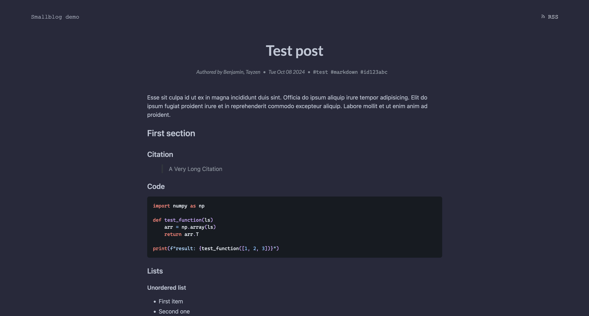

# Smallblog

Smallblog is an easy-to-use blog engine build with [smallweb](https://www.smallweb.run/) in mind.

 

Smallblog is very efficient to use, you just have to write your article in a Markdown format, and it's directly online. Everything is generated directly by scanning a folder, your blog post is automatically published without any compilation, CI/CD, etc...

It includes all the features you need for a blog:

* Easy syntax to write your articles (no need to edit HTML directly)
* Good SEO (with `robot.txt`, `sitemap.xml`, metadata and good structure)
* Great accessibility
* Quick loading pages
* RSS feed
* Search feature
* Automatic reading time estimation (incoming)
* It works well without JS

## Demo

A demo is available at this URL: [Smallblog Demo](https://smallblog-demo.tayzen.dev).

## Usage

### Writing an article

When smallblog is correctly installed you just have to write your markdown files in your dedicated folder (this folder can change with the configuration, in this example, it is: `posts/`).

Smallblog doesn't come with an editor to write blog post. To write this article you can use whatever way you want using the power of smallweb:

* use an editor on another subdomain (vscode or [codejar](https://jsr.io/@pomdtr/smallweb-codejar@0.1.3))
* directly on your server with ssh and a text editor
* with your local vscode connected to the server through SSH
* using [mutagen](https://docs.smallweb.run/hosting/vps.html#syncing-files-using-mutagen)

When you're writing your posts don't forget to write the metadata section, as in this example:

```markdown
---
title: Test post
description: A post to test the markdown rendering
authors:
    - Tayzen
tags:
    - test
published: true
date: 2024-10-08
---

This is a text after the metadata.
```

This metadata is displayed to the user, except for the `published` one. This property is used by the engine to not display articles whose its value is not set to `true` ([posts/private.md](posts/private.md) is an example).

### Serving static files

A `staticFolder` is mandatory in the configuration of smallblog, in this example this value is `static/`. As its name implies, this folder should contain all the static files (images, videos or downloadable files) of your blog.

When you want to use a static file in an article, the path to access it should be the one to the corresponding resource in the web browser (not your OS's path).
For example, in the file [posts/post_test.md](posts/post_test.md) you can see a reference to the picture `deno_logo.png` and the path used is not `static/img/deno_logo.png` or `../static/img/deno_logo.png` but `/img/deno_logo.png` instead. That's because from the web browser this logo is accessible with the following URL: [smallblog-demo.tayzen.dev/img/deno_logo.png](https://smallblog-demo.tayzen.dev/img/deno_logo.png).

### Adding custom scripts

You may want to add custom scripts for analytics purposes (or anything else you may want). For this purpose, there are 2 variables in the configuration of smallblog:

* `customHeaderScript`: The script will be added between the tags `<head></head>`, be careful, because of HTMX boosting, they will only execute with full page refresh.
* `customBodyScript`: The script will be placed at the top of the `<body></body>`, it will be executed at every page change.

I configured [plausible.io](https://plausible.io) in my personal blog. They are asking you to set up their script in the header of the pages, but I only got the tracking working correctly when I moved the script in the body.

## Installation

2 methods of installation are available:

* Import from JSR: If you want the simplest way to use smallblog, this is for you.
* Cloning this repo: If you want to customize the look and feel of your blog.

### Method 1: JSR import

Incoming

1. In your smallweb folder create a new folder (a.k.a. subdomain).
2. In this folder add a `main.tsx` file
3. Add the import statement: `import { createBlogApp } from ...`
4. Export the result of the imported function with the configuration you want (see the example below)
5. Enjoy, your blog is already running!

```tsx
import { createBlogApp } from "tayzen/smallblog";
import { html } from "hono/html";

const url = "https://smallblog-demo.tayzen.dev";
const postsFolder = Deno.env.get("POSTS_FOLDER") || "posts/";
const staticFolder = "static/";
const faviconPath = "/favicon.ico";
const siteTitle = "Smallblog demo";
const indexTitle = "A blog about nothing";
const indexSubtitle = "A nice demo of smallblog";
const customBodyScript =
  html`<script defer data-domain="smallblog-demo.tayzen.dev" src="https://plausible.io/js/script.js"></script>`;

export default createBlogApp({
  baseUrl: url,
  postsFolder,
  staticFolder,
  faviconPath,
  siteTitle,
  indexTitle,
  indexSubtitle,
  customBodyScript,
});
```

### Method 2: Cloning the repo

1. Go to your smallweb folder: `cd /path/to/your/smallweb/folder`
2. Clone the repo with the folder name you want: `https://github.com/TayzenDev/smallblog.git folder_name`
3. Edit the code
4. Enjoy!

To help you edit what you want, this is an overview of the code organization:

* To customize the pages and components, you can look into the `pages/` folder
* To look at the "business logic", you can check the file `blog.ts`
* To edit only styling, the `style.css` is available in the static folder
* The hono server and blog creation function are located in the `mod.ts` file.

## Technologies

The list of technologies/libraries used:

* [hono](https://hono.dev/) for the routing
* [deno-gfm](https://deno.land/x/gfm@0.6.0) to render the markdown into blog posts
* [HTMX](https://htmx.org/) to boost the pages (avoiding full page refreshes) and make a "see result as you type" search feature
* [minisearch](https://lucaong.github.io/minisearch/) to do the search feature (which is executed server-side)
* the [RSS node package](https://www.npmjs.com/package/rss) to dynamically create the RSS feed
* the [sitemap node package](https://www.npmjs.com/package/sitemap) to dynamically generate the sitemap

I made the blog worked even without JS on the client without sacrificing too much on the experience (you just don't have page boosting, and you have to type on enter to search for posts). So, all the features are executed server-side, even the pagination and the search.
